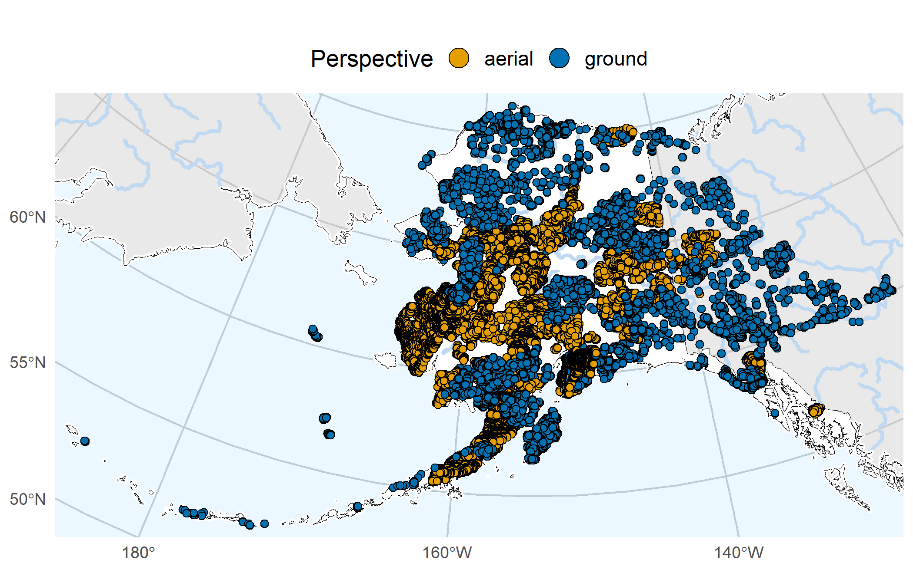

  

# Code Repository for the AKVEG Database

## Harmonized vegetation field observations from Alaska and adjacent Canada

_Amanda Droghini , Timm W. Nawrocki <a href="https://orcid.org/0000-0003-3674-3976">_

The Alaska Vegetation (AKVEG) Database is a cloud-based, PostgreSQL database that contains harmonized field observation data on vegetation cover, environmental site characteristics, and soils metrics for over 44,000 plots in Alaska and adjacent Canada.

Data in AKVEG span five decades, four bioclimatic zones, and two nations, making it one of the most comprehensive field vegetation databases in northwest North America.

## About the Project 🌿

The AKVEG Database provides researchers and land managers with easy-to-use, harmonized data on vegetation cover and associated environmental characteristics. Prior to being added to the AKVEG Database, all datasets are cleaned and standardized to a common schema: qualitative values are re-classified, measurement units are standardized, and scientific names are reconciled to a taxonomic standard.

The AKVEG Database contains:

- Site- and date-specific observations of vegetation and related environmental characteristics.
- Methodological metadata for all datasets, allowing users to evaluate whether a specific dataset or site is appropriate for their application.
- A taxonomic standard to reconcile taxon names and concepts applied in Alaska and adjacent Canada.

The AKVEG Database supports a variety of projects related to conservation, vegetation ecology, wildlife ecology, and land use planning. Data in AKVEG have been used to:

- Provide biodiversity data for the region.
- Develop [ecologically detailed vegetation maps](https://www.akveg.org/maps).
- Update vegetation classification schemes.
- Predict [important wildlife habitat](https://doi.org/10.1002/ecs2.70069).

## Getting Started 🖥️

The AKVEG Database is built in PostgreSQL and hosted on a cloud server. You will need server credentials to access the database, which you can request by filling out a [Database Access Form](https://akveg.org/request-database-access/). The database is public and free to use; the purpose of the server credentials is to prevent excessive loads on the server and for us to know how many people are connecting.

This repository provides example scripts in Python and R to connect to and query the AKVEG Database. These scripts are located in the `user_tools/` folder.

## Documentation 📚

The reference for the AKVEG Database can be accessed via the [AKVEG Database Documentation site](https://docs.akveg.org/).

Our online documentation includes a detailed guide for connecting to, understanding, and exploring the AKVEG Database.

Once you have obtained the server credentials, the [Getting Started tutorial](https://docs.akveg.org/docs/database/get-started/) will guide you through connecting to the database and executing simple queries to extract data from the database.

## Update Schedule 🗓️

The AKVEG Database is updated at least once a quarter. If you need a static version of the data, you can export your query results to a CSV file.

Changes related to the code repository are recorded in the [CHANGELOG](CHANGELOG.md), while changes related to the taxonomic standard are documented in the [TAXONOMY CHANGELOG](CHANGELOG_TAXONOMY.md). Changes related to datasets and the database schema are documented in the `database_version` table of the database.

## Navigating the Repository 📂

This repository is organized into the following folders:

- `01_database_build/`: Core SQL scripts that establish the relational schema and constraints for the AKVEG Database.
- `02_data_format/`: R and Python scripts used to clean, standardize, and format raw datasets into the common AKVEG schema.
  - The main processing scripts are in the `initial_processing/` folder. Within this folder, scripts are organized by an internal dataset ID and numbered sequentially by execution order. This sequence follows the table numbering used in the Alaska Vegetation Working Group's _[Minimum Standards Version 1.1](https://agc-vegetation-soa-dnr.hub.arcgis.com/)_: Scripts with `01_` format the Project table, `02_` format the Site table, etc. The sequence may skip a number if a dataset lacks data to populate a specific table or if the data for that table have not been processed yet.
  - The `taxonomic_updates/` subfolder houses the scripts for updating the taxonomic standard. The date of the update is appended to the file name to facilitate matching the script to the changes in the [TAXONOMY CHANGELOG](CHANGELOG_TAXONOMY.md).
- `03_data_insert/`: R and Python scripts that compile the processed datasets, apply post-hoc corrections, and insert the compiled tables into the private staging database.
- `04_replicate/`: Tools for replicating the private staging database into three deployment environments: private production, public staging, and public production. Includes a step-by-step Markdown guide for creating database backups and duplicating environments in Google Cloud SQL, and a Python script that removes private data from the public staging database. To ensure no private data appears in the public production environment, this script must be run before the public staging database is replicated to the final, public production environment.
- `assets/`: Repository media assets, including the AKVEG Database project logo and a map illustrating the spatial distribution of the vegetation plots.
- `manuscript/`: Supplementary code used to generate figures and tables in the accompanying Data Descriptor paper, as well as code to export the database tables into CSV files for deposition in a data repository.
- `pull_functions/`: Shared helper functions in R and Python that support both the processing pipeline and the `user_tools/` example scripts. The functions manage database authentication and translate database queries into standard R and Python dataframes. For Python users, these tools can be installed via the [akveg-utils repository](https://github.com/akveg-map/akutils).
- `user_tools/`: Example R and Python scripts that illustrate how to connect to the cloud-hosted database (`connection_examples/`), and SQL scripts (`queries/`) that perform table joins so users can obtain human-readable values rather than foreign key IDs. The SQL scripts are numbered according to the same table numbering convention as the scripts in the `initial_processing/` folder, but do not need to be executed sequentially.

## Built With 🛠️

- Python 3.13.12
- R 4.6.0
- PostgreSQL 17.9

Exact package versions for Python and R are documented in the environment files included in this repository.

### Python Environment

Python dependencies are managed via Conda/Miniforge and are provided in `environment.yml`.

To replicate, run `conda env create -f environment.yml`

### R Environment

R dependencies are tracked via `renv`. They are provided in the `renv.lock` file.

To replicate, install the `renv` package in R, set your working directory to this repository's root folder, and run `renv::restore()`.

### SQL Environment

SQL scripts were executed in a PostgreSQL 17.9 on a Google Cloud SQL instance. No extensions are required.

## License ⚖️

This repository contains only the scripts used to build the AKVEG Database. It does not include the data themselves.

All scripts and configuration files in this repository are licensed under the [MIT License](LICENSE). You are free to copy, modify, distribute, and use this software, including for private and commercial purposes. If you wish to re-distribute this code, please include the original copyright notice and permission notice in your code package.

## Citation

If you use these scripts to process data for your research, you can cite this software repository:

> Droghini, A., and T.W. Nawrocki. 2026. Code Repository for the AKVEG Database: Harmonized vegetation field observations from Alaska and adjacent Canada (v2.9.2). Zenodo. https://doi.org/10.5281/zenodo.20635288.

If you use data from the AKVEG Database, please cite the database itself. The version number can be found in the `database_version` table of the database.

> Droghini, A., T.W. Nawrocki, A.F. Wells, M.J. Macander, and L.A. Flagstad. 2026. Alaska Vegetation (AKVEG) Database: Harmonized vegetation field observations from Alaska and adjacent Canada [insert version number]. Alaska Geospatial Council, Vegetation Working Group. Available: [https://www.akveg.org](https://www.akveg.org). Data downloaded on [date of query].

## Contributing 🤝

If you've spotted an error in the database, [open a new issue](https://github.com/accs-uaa/akveg-database-public/issues). Please review existing issues beforehand to avoid duplication. If your issue already exists, add a comment to help us prioritize issues that are most relevant to our users.

If you would like to contribute a dataset, consult the [Become a contributor](https://docs.akveg.org/docs/database/contribute/) section of our documentation.

## Acknowledgments 🫶

The AKVEG Database is supported by the U.S. Fish and Wildlife Service and the Bureau of Land Management. We are grateful to all the organizations and scientists who contributed the datasets processed by the scripts in this repository, as this work would not be possible without them. The full list of data contributors can be found in the `projects` table of the AKVEG Database.

## Authors

- **Amanda Droghini** - _Alaska Center for Conservation Science, University of Alaska Anchorage_
- **Timm W. Nawrocki** - _Alaska Center for Conservation Science, University of Alaska Anchorage_

## Contact 📧

- **Project Maintainer**: Amanda Droghini
- **Email**: adroghini (at) alaska (dot) edu
- **GitHub**: [@adroghini](https://github.com/adroghini)
